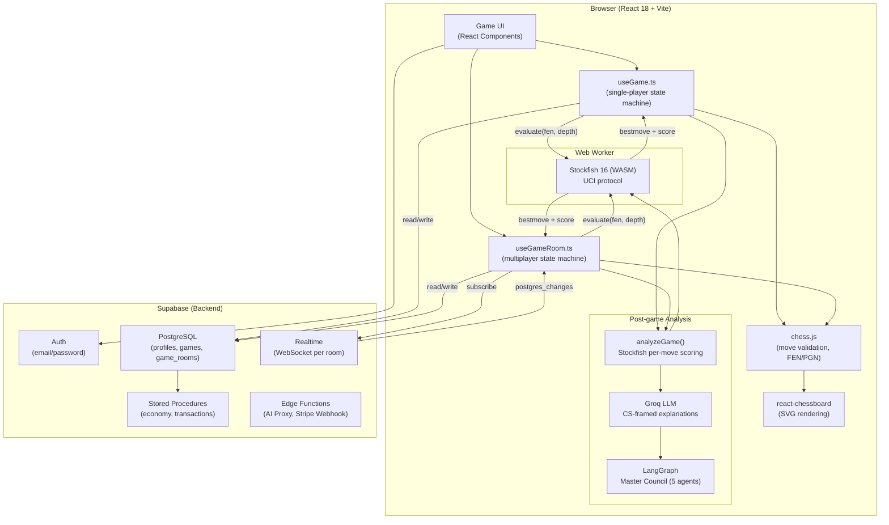
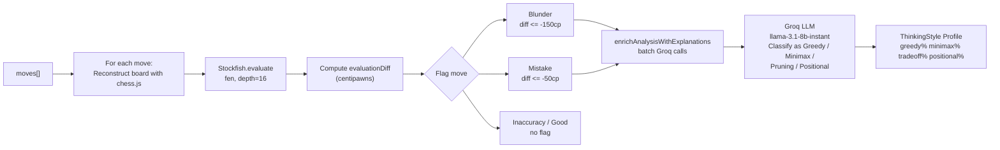
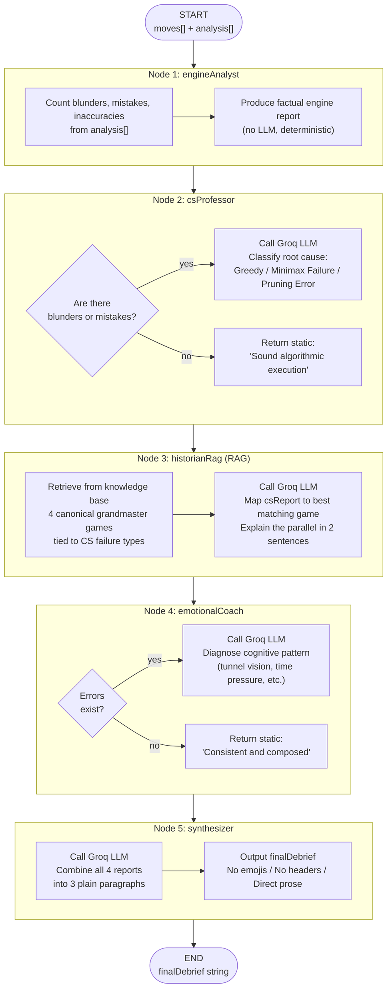
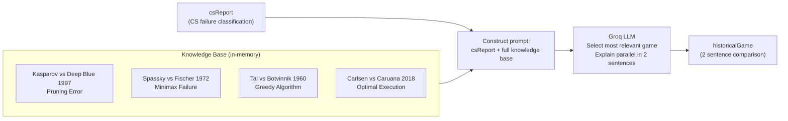
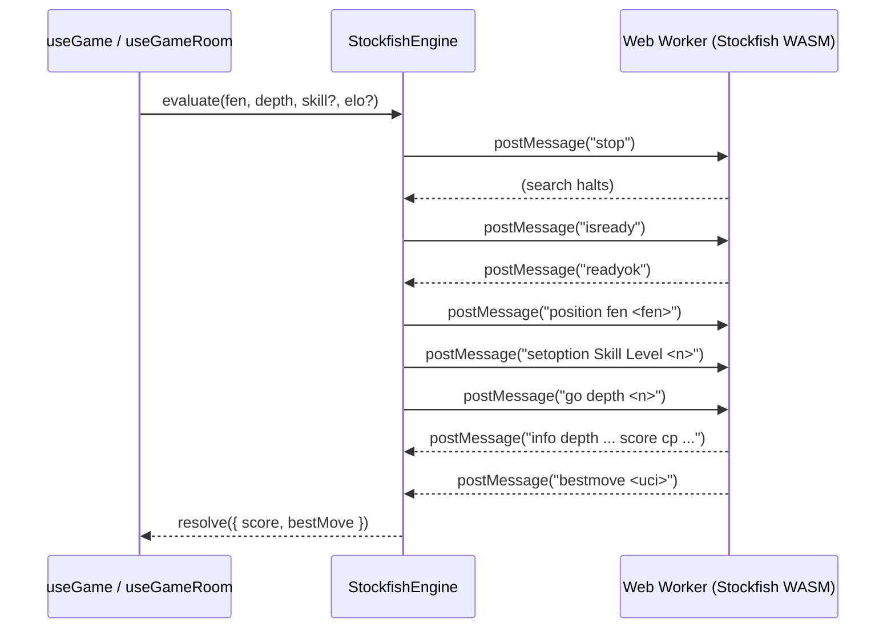
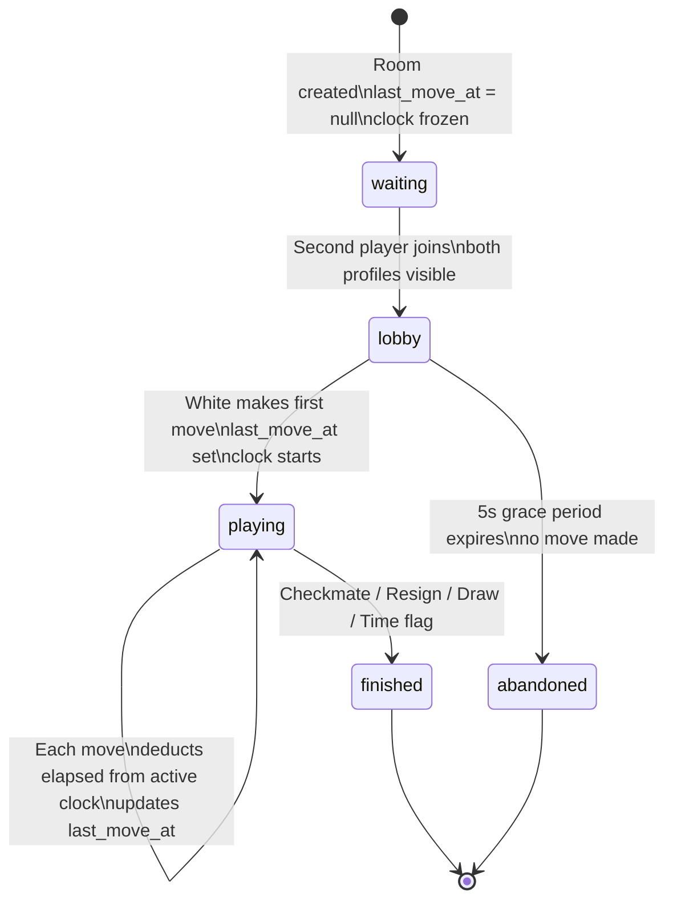
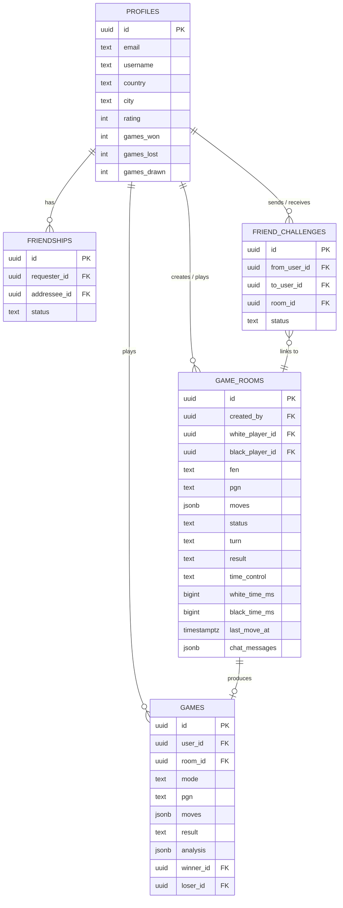

# AlgoChess

AlgoChess is a chess platform that uses computer science as a lens for game analysis. It is built for students, developers, and competitive players who want to understand not just what mistake they made, but what algorithmic failure caused it — greedy local optimization, failure to evaluate the opponent's best reply (minimax), premature search pruning, or structural positional neglect.

The system runs a real-time Stockfish evaluation engine in the browser, a multi-agent LangGraph pipeline for post-game debrief, a retrieval-augmented generation (RAG) historian that maps your play to historical grandmaster games, and a full multiplayer suite built on Supabase Realtime.

---

## Live Deployment

| | |
|---|---|
| **Production URL** | https://nfac-chess.vercel.app |
| **Repository** | https://github.com/n6s8/nfac-chess |
| **Hosting** | Vercel (static, auto-deploy on push to main) |
| **Database** | Supabase PostgreSQL — live, connected, RLS enabled |
| **Backend API** | Supabase Edge Functions (Secure API proxy, Stripe Webhooks) |
| **Auth** | Supabase Auth — email/password, session-based |
| **Monetization** | Stripe Checkout & Webhooks (Test Mode) |
| **AI Inference** | Groq API — llama-3.1-8b-instant, live |
| **Chess Engine** | Stockfish 16 WASM — runs in browser Web Worker, no server |

All external services (Vercel, Supabase, Groq, Stripe) are fully connected and operational in production. The multiplayer rooms, ELO updates, game history, virtual economy, and AI debriefs all write to and read from the live Supabase database. Server-side secrets are securely managed in Supabase Edge Functions.

---

## What Was Built

| Area | Description |
|---|---|
| Single-player vs Engine | Play against Stockfish at 4 difficulty levels (Beginner to Master). Each move is classified in real time using a heuristic algorithm. |
| Post-game Analysis | Full Stockfish re-analysis of every move. Blunders and mistakes are explained through CS theory by a Groq LLM. |
| Multi-agent Debrief | A 5-node LangGraph graph runs in sequence: Engine Analyst, CS Professor, Historian (RAG), Emotional Coach, Synthesizer. Produces a short, honest text debrief. |
| Multiplayer | Real-time rooms via Supabase Realtime. Clock, draw negotiations, chat, and ELO updates persist to PostgreSQL. |
| Friends and Challenges | Friend request system with search by username. Accepted friends can be challenged directly from the profile page, which creates a room and sends a notification. |
| Rating System | ELO-style rating adjustments after every game, shown as a delta chip on the board after the result. |
| Profile and History | Full game history with replay support. Country/city-based leaderboard. |
| Economy & Store | Server-side coin economy (earn coins by playing). Purchase board themes in the Store. |
| Monetization (Pro) | Fully integrated Stripe Checkout to upgrade to Pro, unlocking the Master Council debrief and exclusive themes. |

---

## Architecture

### System Overview



---

### Post-game Analysis Pipeline

After a game ends, `analyzeGame()` iterates over every move and evaluates each resulting position with Stockfish. Then `enrichAnalysisWithExplanations()` sends the flagged mistakes to Groq for CS-framed explanations.



---

### LangGraph Multi-agent Pipeline (Master Council)

Five agents run in a strict sequential directed acyclic graph. No branching. Each node reads the full state produced so far, adds its own report, and passes the enriched state to the next node.



---

### RAG: How the Historian Agent Retrieves

The RAG in this system is prompt-based retrieval, not vector search. The knowledge base is a fixed set of 4 annotated games injected directly into the Groq prompt. The LLM performs the semantic matching.



> The knowledge base is injected wholesale. The LLM acts as the retriever and ranker. For production scale (hundreds of games), replace with pgvector semantic search and an embedding model.

---

### Stockfish Concurrency Model

Stockfish runs in a Web Worker and speaks UCI. Evaluations are serialized — only one evaluation runs at a time.



---

### Multiplayer State and Clock



---

### Database Schema



---

## Tech Stack

| Layer | Technology |
|---|---|
| Frontend | React 18, TypeScript, Vite |
| Styling | Tailwind CSS v3, custom CSS variables for theming |
| Chess Engine | Stockfish 16 (WASM) via Web Worker, UCI protocol |
| Chess Logic | chess.js (move validation, FEN, PGN) |
| Board UI | react-chessboard |
| Database | Supabase (PostgreSQL, Row Level Security, Realtime) |
| Auth | Supabase Auth (email/password) |
| AI Inference | Groq API, llama-3.1-8b-instant |
| Multi-agent | LangChain LangGraph (StateGraph, sequential DAG) |
| Routing | React Router v6 |

---

## Setup

### Prerequisites

- Node.js 18+
- A Supabase project (free tier is sufficient)
- A Groq API key (free tier is sufficient for development)

### Steps

**1. Install dependencies**

```bash
npm install
```

**2. Copy the engine binary into the public directory**

```bash
npm run setup:stockfish
```

This copies Stockfish WASM files from `node_modules/stockfish` into `public/` so the Web Worker can load them at runtime.

**3. Configure environment variables**

```bash
cp .env.example .env.local
```

Edit `.env.local`:

```
VITE_SUPABASE_URL=https://<your-project>.supabase.co
VITE_SUPABASE_ANON_KEY=<your-anon-key>

# For basic single-player move analysis
VITE_GROQ_API_KEY=gsk_...

# Stripe public keys
VITE_STRIPE_PUBLISHABLE_KEY=pk_test_...
VITE_STRIPE_PRICE_ID=price_...
```

**Note on Security:** Sensitive keys (`STRIPE_SECRET_KEY`, `STRIPE_WEBHOOK_SECRET`, and the main `GROQ_API_KEY` for the Master Council) are stored securely in **Supabase Secrets** and are only accessed by Edge Functions. They are never exposed to the browser.

**4. Apply the database schema**

Open the Supabase SQL editor and run the contents of `supabase/schema.sql` in full. This creates all tables, indices, RLS policies, triggers, and the `record_multiplayer_result` stored procedure.

If you are updating an existing deployment, the schema uses `create table if not exists` and `alter table ... add column if not exists` throughout. It is safe to re-run.

**5. Start the development server**

```bash
npm run dev
```

The app runs on `http://localhost:5173` by default.

### Environment Variables Reference

| Variable | Required | Description |
|---|---|---|
| `VITE_SUPABASE_URL` | Yes | Supabase project URL |
| `VITE_SUPABASE_ANON_KEY` | Yes | Supabase anon public key |
| `VITE_GROQ_API_KEY` | No* | Groq API key for LLM features |
| `VITE_OPENAI_API_KEY` | No* | OpenAI key (fallback for Groq) |

*At least one LLM key is required for move explanations and the multi-agent debrief.

---

## Project Structure

```
src/
├── components/
│   ├── AnalysisPanel.tsx       Post-game analysis UI, worst moves, master council trigger
│   ├── ChessBoard.tsx          Board rendering, move interaction, resign/draw controls
│   ├── MasterCouncilPanel.tsx  Multi-agent debrief UI and status display
│   ├── MoveHistory.tsx         Scrollable move list with analysis overlay
│   └── PreferenceToolbar.tsx   Board theme, engine level, focus mode controls
├── hooks/
│   ├── useGame.ts              Single-player state machine, Stockfish loop, rating updates
│   ├── useGameRoom.ts          Multiplayer state, clock, draw negotiations, Realtime sync
│   └── useFriends.ts           Friends list, pending requests, challenge notifications
├── lib/
│   ├── agents.ts               LangGraph graph definition (5-node sequential pipeline)
│   ├── ai.ts                   Move analysis orchestration, Groq enrichment
│   ├── chess.ts                chess.js wrappers (makeMove, getFen, getGameResult, etc.)
│   ├── stockfish.ts            StockfishEngine class, UCI protocol, Web Worker bridge
│   ├── supabase.ts             All database operations, auth, friends, challenges
│   └── time-controls.ts        Time control configs (bullet, blitz, rapid, classical)
├── pages/
│   ├── Game.tsx                Single-player layout, player cards, eval bar
│   ├── MultiplayerRoom.tsx     Multiplayer layout, lobby, countdown, clock bars
│   ├── Profile.tsx             User profile, game history, friends tab, challenges
│   ├── Friends.tsx             Friend search, requests, challenge flow
│   ├── Leaderboard.tsx         Country/city-filtered rating leaderboard
│   └── Replay.tsx              Move-by-move game replay from history
└── types/
    └── index.ts                All shared TypeScript interfaces and type aliases
```

---

## Known Limitations

**RAG knowledge base**: The historian agent uses a fixed 4-game knowledge base injected into the prompt. It is not a semantic vector search. Results are plausible but not verifiably accurate. Extending this to a real retrieval system would require a vector store and an embedding model.

**Clock authority**: Time enforcement runs on the room creator's browser. If the creator disconnects mid-game, the clock stops. A production implementation would move this to a server-side cron or Edge Function.

**ELO simplification**: The current rating system applies fixed deltas (+15 win, -15 loss, 0 draw for single-player; +16/-16/+4 for multiplayer via stored procedure). It does not account for opponent strength. Replace with a proper ELO formula if ranking fidelity is a requirement.
